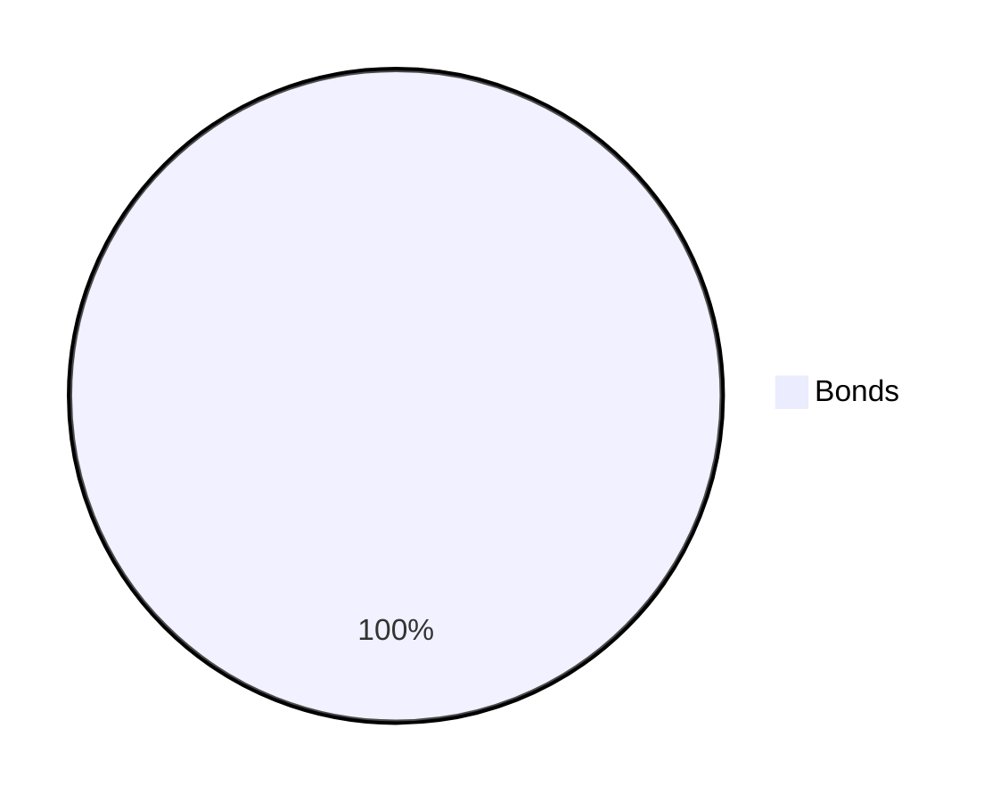
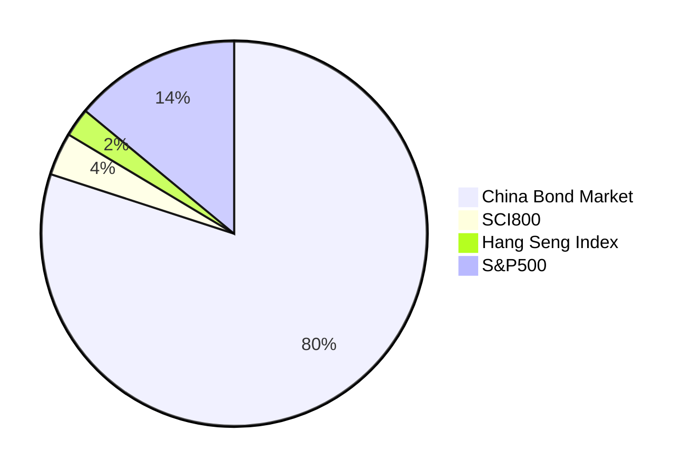
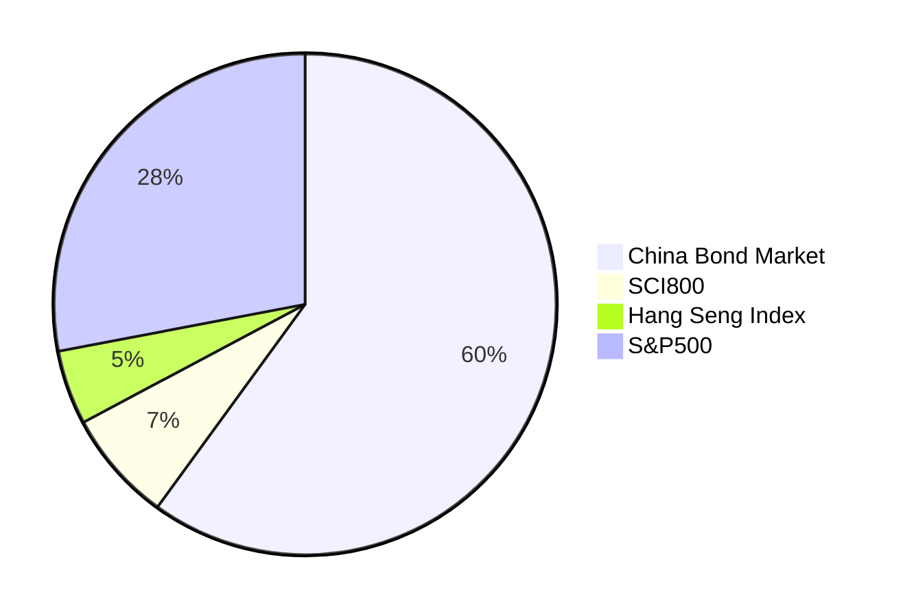
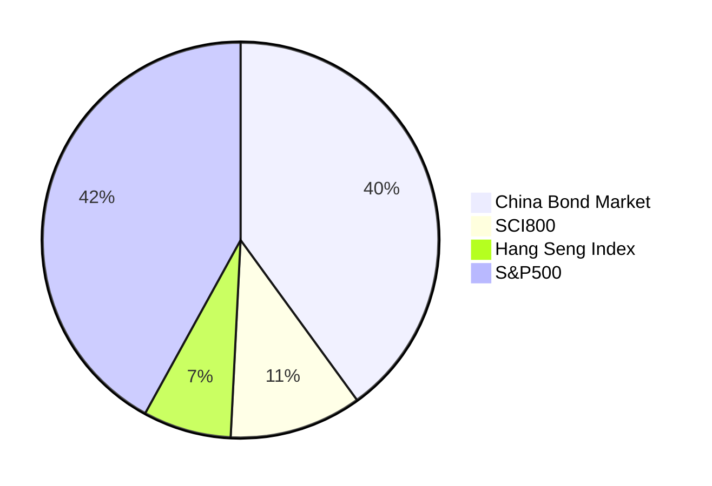
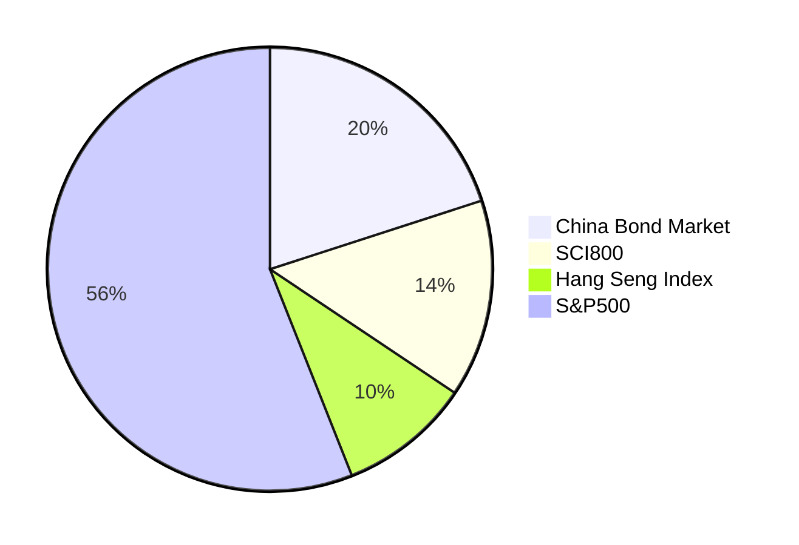
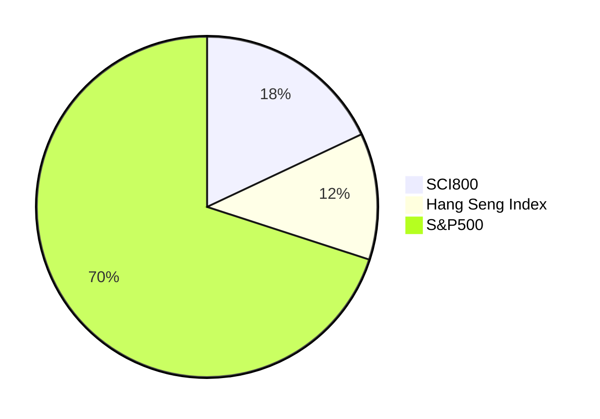

# Chinese Couch Potato

This writing is my personal note to create a Chinese investor's equivalent of the Canadian Couch Potato[^1]. In the US, there is the Bogleheads community[^2] that advocates for "lazy portfolios" consisting of bond and stock index funds (ETFs). For the average person, the best way to invest money is through a well-diversified portfolio made up of bonds and stocks. To avoid market timing, which can lead to long-term investment losses, periodic contributions to the portfolio are recommended.

Some of the information provided here is hard to find in Chinese sources but essential to building a portfolio.

## Available Asset Classes

The asset classes that are meaningful to invest in and available for investors in China as mutual funds or ETFs are as follows:

- China bonds
  - Various segments are available, including government, credit, high-yield and convertible
- A shares (Shanghai & Shenzhen stock exchanges)
  - SCI300 index (沪深 300), a large-cap index capturing 70% of capitalization
  - SCI800 index (中证 800), large and mid caps accounting for 95% capitalization
- Hong Kong-listed stocks
  - Hang Seng Index (恒生指数), a large cap index for stocks listed in Hong Kong stock exchange representing 58% capitalization
  - Hang Seng China Enterprises Index (恒生中国企业指数), including companies that have close business ties to mainland China
- U.S. stocks
  - Nasdaq 100 and S&P500 are both available as QDII funds.

## Capital Market Assumptions

The assumptions for return are as follows:

- For bonds, long-term inflation plus 2%
- For stocks, assume a 7% real return (i.e., after deducting 2% inflation)

The assumptions for volatility primarily use trailling 10 years' data from respective indexes, or their equivalents.

Assumptions for correlation are:

- From various high-quality sources
- Verified, cross-checked or/and computed by the me

### Return and Volatility

| Asset Class       | Total Return | Volatility |
| ----------------- | -----------: | ---------: |
| China Bond Market |        3.70% |      2.13% |
| A Shares          |        8.70% |     22.34% |
| HK-listed Stocks  |        8.40% |     18.22% |
| U.S. Large        |        7.95% |     14.01% |

Note:

1. Total return is net of management fees of representative ETFs/mutual funds and foreign withholding taxes.
2. Volatility sources are as follows:
   - China Bond Market: factsheet for S&P China Bond Index
   - Chinas A Shares: factsheet for MSCI China A Onshore Index
   - HK-listed Stocks: factsheet for MSCI Hong Kong-listed Southbound Index
   - U.S. Large: factsheet for S&P500

### Correlation

| Asset Class       | China Bond Market | Chinas A Shares | HK-listed Stocks | U.S. Large |
| ----------------- | ----------------: | --------------: | ---------------: | ---------: |
| China Bond Market |                 1 |               0 |                0 |          0 |
| A Shares          |                 0 |               1 |             0.72 |       0.45 |
| HK-listed Stocks  |                 0 |            0.72 |                1 |       0.61 |
| U.S. Large        |                 0 |            0.45 |             0.61 |          1 |

Note:

1. The correlations between bonds and stocks are assumed to be 0.
2. The correlation between A shares and Hong Kong-listed stocks is computed by the author from the volatilities of MSCI Hong Kong-listed Southbound Index, MSCI China A Onshore Index and MSCI Hong Kong-listed Southbound + China A Index.
3. The correlation between A shares (SCI300) and U.S. Large (S&P500) is taken from a research paper[^3].
4. The correlation between Hang Seng Index and S&P500 is taken from a blog post on CFA Institute[^4].

## Representative Funds

The following low-cost index funds that are available for investors in mainland China are selected to represent these four asset classes.

| Asset Class             | Fund Name               | Ticker |
| ----------------------- | :---------------------- | :----- |
| China Bond Market       | 博时中债 3-5 年国开行 C | 007486 |
| A Shares                | 易方达中证 800ETF       | 515810 |
| Hong Kong-listed Stocks | 华夏沪港通恒生 ETF      | 513660 |
| U.S. Large              | 博时标普 500ETF         | 513500 |

Note:

1. For China Bond Market, I used a policy lender (国开行/China Development Bank) bond index fund because of its high credit, low fees and indexing, instead of broad market bond fund.
2. There are many subsititutes for these funds. The above-shown are just examples.

## Model Portfolios

The model portfolios were derived from running Markowitz portfolio optimization, with slight adjustments made by me. Similar to investors in other markets[^5], there is an optimal home bias for investors. Overall, I believe that allocating between 50-80% of the equity portion to international stocks (U.S. equity) may be a good option for Chinese investors, especially considering that most investors do not allocate any of their investments to foreign stocks (to their disadvantage). The split between A shares and HK-listed stocks can vary from 50/50 to 80/20. My model portfolios have chosen a split of 18/12/70 among Shanghai & Shenzhen, HK, and the US, which I personally believe is the best ratio.

### Income

#### 100% Bonds

#### 20% Stocks/80% Bonds

### Balanced

#### 40% Stocks/60% Bonds

#### 60% Stocks/40% Bonds

### Growth

#### 80% Stocks/20% Bonds

#### 100% Stocks

## Disclaimer

The information provided in this document is for informational purposes only and should not be construed as financial advice. While reasonable efforts have been made to ensure the accuracy and completeness of the information presented, no warranty or guarantee is made as to its accuracy, reliability, completeness, suitability, or availability. Any reliance placed on this information is strictly at your own risk. It is recommended that you consult with a professional financial advisor or investment manager before making any investment decisions. The author disclaims any liability for any damages or losses that may arise from the use of or reliance on this information.

[^1]: Canadian Couch Potato. https://canadiancouchpotato.com/
[^2]: Bogleheads. https://www.bogleheads.org/
[^3]:
    S&P Dow Jones Indices. May 2021. Why the S&P 500® Matters to
    China. https://www.spglobal.com/spdji/en/documents/research/research-why-the-sp-500-matters-to-china.pdf

[^4]:
    Derek Horstmeyer, Juhee Hong and AnhMinh Luu. 02 November 2021. Chinese and World Stock Market Co-Movements: Two Findings.
    https://blogs.cfainstitute.org/investor/2021/11/02/chinese-and-world-stock-market-co-movements-two-findings/

[^5]:
    Vanguard. April 2021. Global equity investing:
    The benefits of diversification
    and sizing your allocation. https://corporate.vanguard.com/content/dam/corp/research/pdf/Global-equity-investing-The-benefits-of-diversification-and-sizing-your-allocation-US-ISGGEB_042021_Online.pdf
