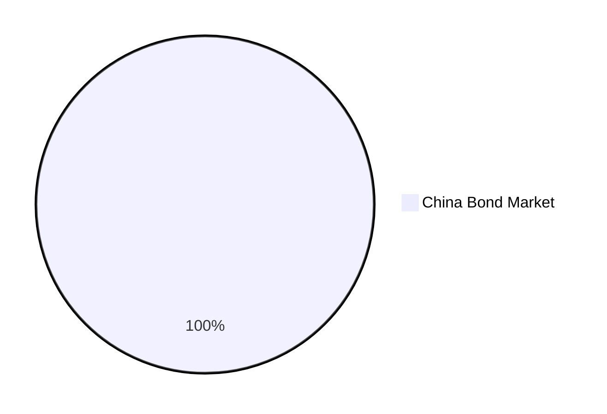
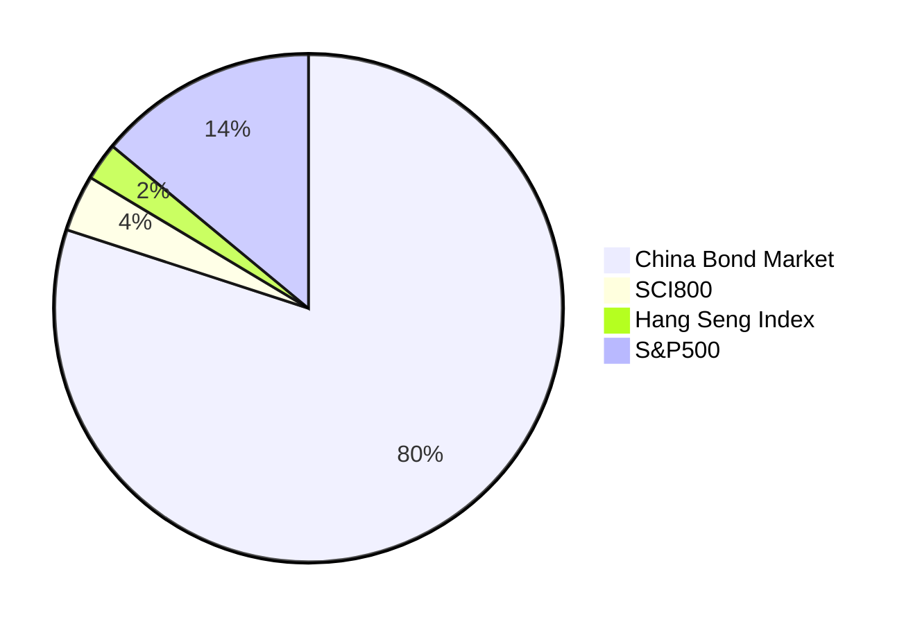
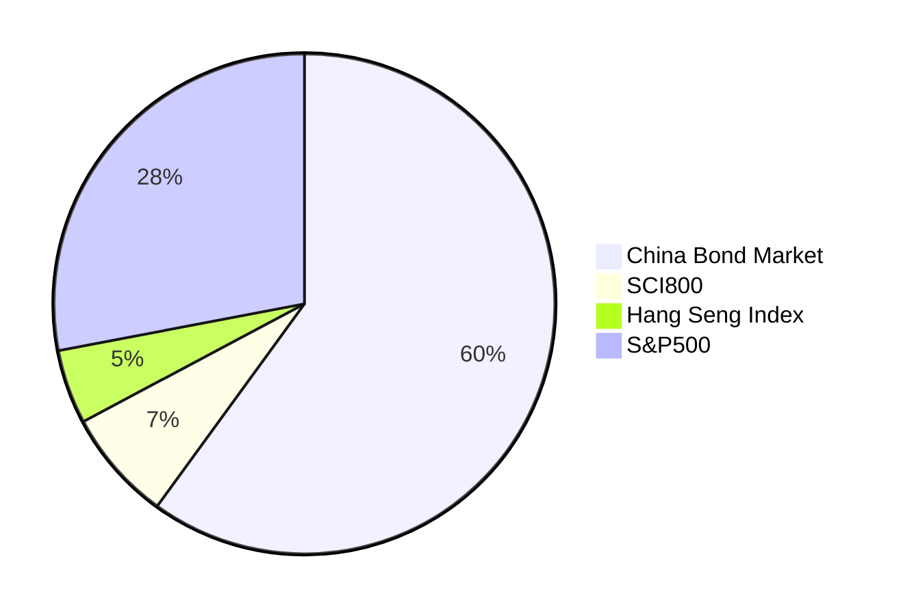
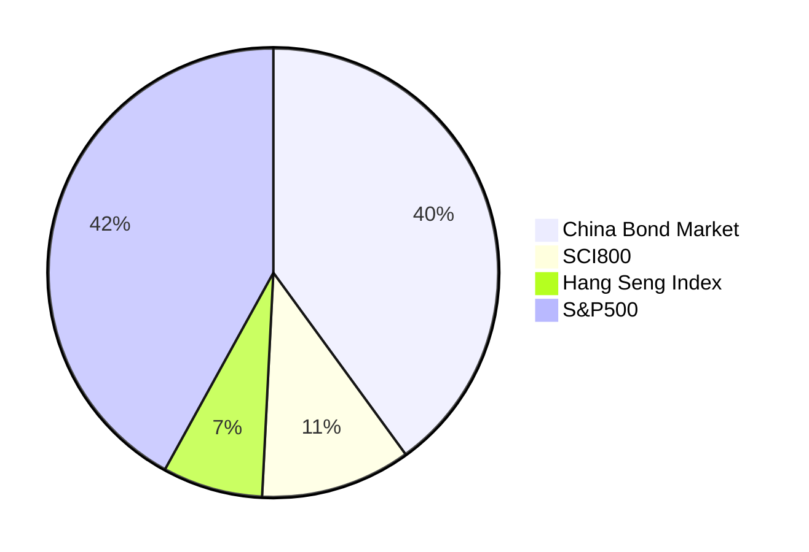
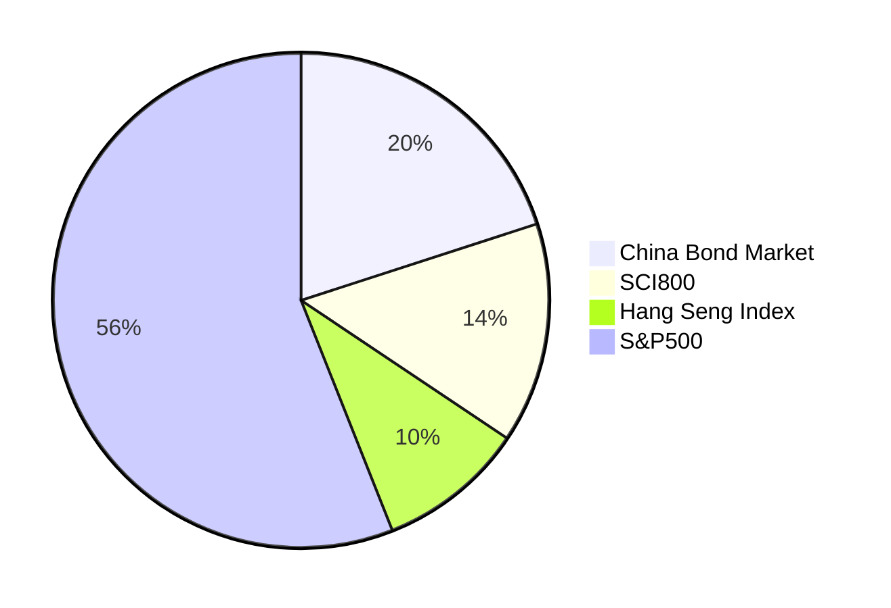
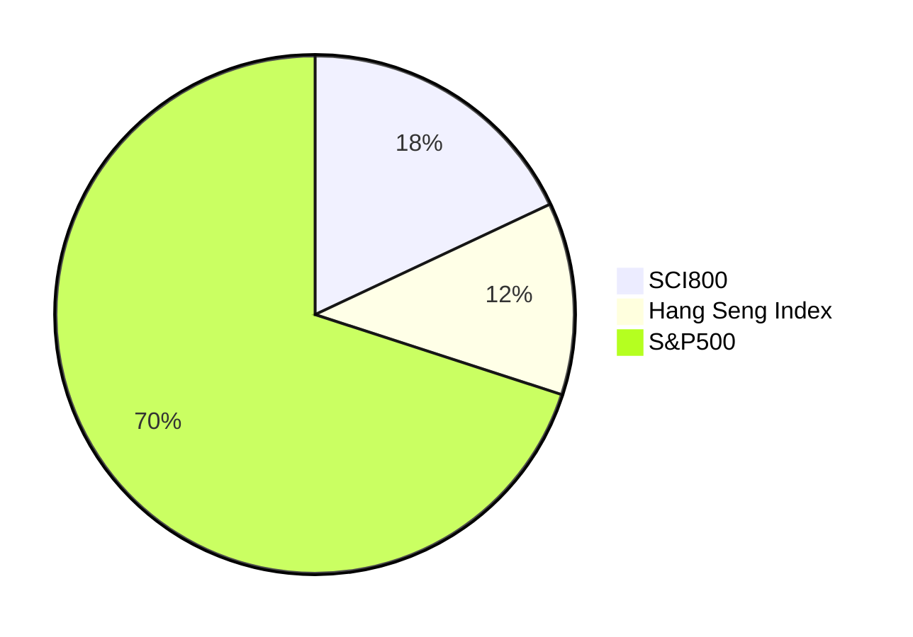

# Chinese Couch Potato

For the average person, a well-diversified portfolio of bonds and stocks is the best way to invest money. Periodic contributions and buy-and-hold strategies can overcome behavioral biases that often lead to long-term investment underperformance. Market timing is one of the worst habits that investors tend to fall into.

Unfortunately, I've seen many Chinese investors putting their money into individual stocks or sector funds based on market sentiment, resulting in below-average long-term investment returns. What's worse, some "experienced" investors and financial professionals don't believe in the consensus of economics.

In Canada, the Canadian Couch Potato[^1] and the Canadian Portfolio Manager[^6] are great references for low-cost, passive, index investing. In the US, the Bogleheads community[^2] advocates for "lazy portfolios" consisting of bond and stock index funds (ETFs).

This writing is my attempt to create a Chinese investor's equivalent of the Canadian Couch Potato, thus the name. Some of the information provided here may be hard to find in Chinese sources but is essential to building a portfolio.

## Available Asset Classes

The asset classes that are meaningful to invest in and available for investors in mainland China as mutual funds or ETFs[^7] are as follows:

* Domestic bonds
  + Various segments are available, including government, credit, high-yield and convertible.
* A Shares (Shanghai & Shenzhen stock exchanges)
  + SCI300 index (沪深300), a large-cap index capturing 70% of capitalization.
  + SCI800 index (中证800), large and mid caps accounting for 95% capitalization.
* Hong Kong-listed stocks
  + Hang Seng Index (恒生指数), a large-cap index for stocks listed in the Hong Kong stock exchange representing 60% capitalization.
  + Hang Seng China Enterprises Index (恒生中国企业指数), consists of companies with close business ties to mainland China.
* U.S. stocks
  + Nasdaq 100 and S&P500 are both available as QDII funds.

## Capital Market Assumptions

The assumptions for return are as follows:

* For bonds, long-term inflation plus 2%
* For stocks, assume a 7% real return (i.e., after deducting 2% inflation)

The assumptions for volatility primarily use the past 10 years' data from respective indexes or their equivalents.

Assumptions for correlation are:

* From various high-quality sources
* Verified, cross-checked or/and computed by me

### Return and Volatility

| Asset Class       | Total Return | Volatility (Standard Deviation) |
| ----------------- | -----------: | ------------------------------: |
| China Bond Market |        3.60% |                           2.13% |
| A Shares          |        8.70% |                          22.34% |
| HK-listed Stocks  |        8.40% |                          18.22% |
| U.S. Stocks       |        7.55% |                          14.01% |

Note:

1. The returns presented here are the total returns after deducting the management and custodian fees (管理费率 and 托管费率) of representative ETFs and mutual funds. Additionally, estimated foreign withholding taxes (2% dividend rate × 30% tax rate) are also deducted from the return of U.S. stocks. However, transaction fees (交易佣金, 认购费率 and 赎回费率) are not deducted from these figures.
2. Volatility sources are as follows:
   - China Bond Market: factsheet for S&P China Bond Index
   - China A Shares: factsheet for MSCI China A Onshore Index
   - HK-listed Stocks: factsheet for MSCI Hong Kong-listed Southbound Index
   - U.S. Stocks: factsheet for S&P500

### Correlation

| Asset Class       | China Bond Market | A Shares | HK-listed Stocks | U.S. Stocks |
| ----------------- | ----------------: | -------: | ---------------: | ----------: |
| China Bond Market |                 1 |        0 |                0 |           0 |
| A Shares          |                 0 |        1 |             0.72 |        0.45 |
| HK-listed Stocks  |                 0 |     0.72 |                1 |        0.61 |
| U.S. Stocks       |                 0 |     0.45 |             0.61 |           1 |

Note:

1. The correlations between bonds and stocks are assumed to be 0.
2. The correlation between A shares and Hong Kong-listed stocks is computed by the author from the volatilities of the MSCI Hong Kong-listed Southbound Index, MSCI China A Onshore Index and MSCI Hong Kong-listed Southbound + China A Index.
3. The correlation between A Shares (SCI300) and U.S. Stocks (S&P500) is taken from a research paper[^3].
4. The correlation between Hang Seng Index and S&P500 is taken from a blog post on CFA Institute[^4].

## Representative Funds

The following low-cost index funds that are available for investors in mainland China are selected to represent these four asset classes.

| Asset Class             | Fund Name         | Ticker |
| ----------------------- | ----------------- | ------ |
| China Bond Market       | 易方达中债新综指A | 161119 |
| A Shares                | 易方达中证800ETF  | 515810 |
| Hong Kong-listed Stocks | 华夏沪港通恒生ETF | 513660 |
| U.S. Stocks             | 博时标普500ETF    | 513500 |

Note:

1. There are plenty of substitutes for these funds. The above-shown are just examples.

## Model Portfolios

The model portfolios are derived from running Markowitz portfolio optimization, with adjustments made by me. 

Most Chinese investors do not allocate any of their investments to foreign stocks. Investors who only invest in A Shares (or A+H Shares) may experience a noticeably worse risk-adjusted return. It is therefore important to allocate a portion of the portfolio to international stocks, as diversification is key to reducing volatility.

Similar to investors in other markets[^5], there is an optimal home bias for Chinese investors. Overall, I believe that allocating between 50-80% of the equity portion to international stocks (U.S. equity) may be a good option. The split between A shares and HK-listed stocks can vary from 40/60 to 80/20. My model portfolios choose a split of 18/12/70 for Shanghai & Shenzhen/HK/US, which I believe is a good starting point.

Below is a summary of the expected return and volatility for various stocks and bonds allocation suitable for different risk profiles. Additionally, the table includes the number of years required to beat the assumed inflation (2%) at a 90% confidence level as "Suggested Years in Market." The asset allocation of these model portfolios is displayed in the pie charts below.

| Asset Allocation     | Expected Return | Expected Volatility (Standard Deviation) | Suggested Years in Market |
| :------------------- | --------------: | ---------------------------------------: | ------------------------: |
| 100% Bonds           |            3.6% |                                     2.1% |                         5 |
| 20% Stocks/80% Bonds |            4.5% |                                     3.3% |                         5 |
| 40% Stocks/60% Bonds |            5.3% |                                     5.8% |                         9 |
| 60% Stocks/40% Bonds |            6.2% |                                     8.6% |                        12 |
| 80% Stocks/20% Bonds |            7.0% |                                    11.4% |                        14 |
| 100% Stocks          |            7.9% |                                    14.2% |                        16 |

### Income

#### 100% Bonds

#### 20% Stocks/80% Bonds

### Balanced

#### 40% Stocks/60% Bonds

#### 60% Stocks/40% Bonds

### Growth

#### 80% Stocks/20% Bonds

#### 100% Stocks

[^1]: Canadian Couch Potato. https://canadiancouchpotato.com/
[^2]: Bogleheads. https://www.bogleheads.org/
[^3]:

    S&P Dow Jones Indices. May 2021. Why the S&P 500® Matters to
    China. https://www.spglobal.com/spdji/en/documents/research/research-why-the-sp-500-matters-to-china.pdf

[^4]:

    Derek Horstmeyer, Juhee Hong and AnhMinh Luu. 02 November 2021. Chinese and World Stock Market Co-Movements: Two Findings.
    https://blogs.cfainstitute.org/investor/2021/11/02/chinese-and-world-stock-market-co-movements-two-findings/

[^5]:

    Vanguard. April 2021. Global equity investing:
    The benefits of diversification
    and sizing your allocation. https://corporate.vanguard.com/content/dam/corp/research/pdf/Global-equity-investing-The-benefits-of-diversification-and-sizing-your-allocation-US-ISGGEB_042021_Online.pdf

[^6]: Canadian Portfolio Manager. https://www.canadianportfoliomanagerblog.com/
[^7]: Bank deposits and direct real estate investing are "meaningful" options but they are not available as mutual funds or ETFs.
